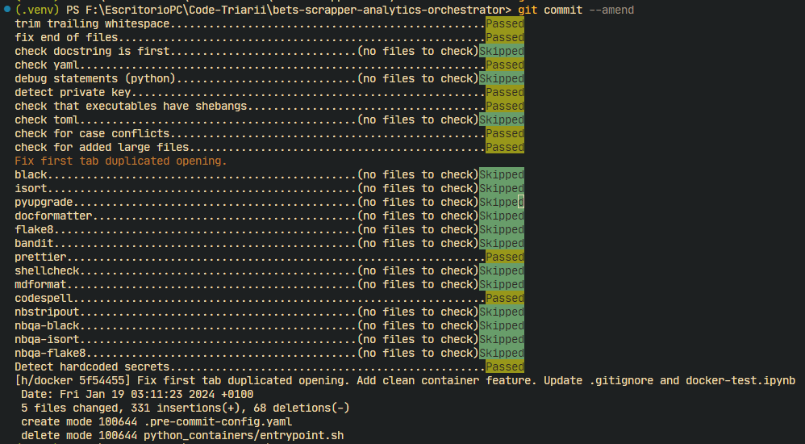

# Pre-commit usage


## Documentation

For more information on how to reuse workflows and utilize environment variables in GitHub Actions, refer to the following GitHub documentation:

- [Workflow syntax for GitHub Actions](https://docs.github.com/en/actions/reference/workflow-syntax-for-github-actions)
- [Context and expression syntax for GitHub Actions](https://docs.github.com/en/actions/reference/context-and-expression-syntax-for-github-actions)
- [Environment variables for GitHub Actions](https://docs.github.com/en/actions/configuring-and-managing-workflows/using-environment-variables)
- [Creating and using encrypted secrets](https://docs.github.com/en/actions/configuring-and-managing-workflows/creating-and-storing-encrypted-secrets)
- [Precommit hooks](https://pre-commit.com/)

For syntax highlighting in Markdown files, we use [GitHub flavored Markdown](https://docs.github.com/es/get-started/writing-on-github/getting-started-with-writing-and-formatting-on-github/basic-writing-and-formatting-syntax).

## Pre-commit Installation and Usage

> [!NOTE]
> We do not use `pre-commit` as a security oriented tool here.

To ensure consistent code quality and follow best practices, we use `pre-commit` hooks in our repository. Follow these steps to use the selected `pre-commit` hooks each time you commit code:

### Installing Pre-commit

1. **Install Pre-commit**: If you don't have `pre-commit` installed, install it using pip:

```bash
pip install pre-commit
```

2. **Install Pre-commit Hooks**: Once `pre-commit` is installed, run the following command to install the hooks in your local repository:

```bash
pre-commit install
```

> If `precommit` is not in PATH, you may need to add it.

### Using Pre-commit

Whenever you commit your changes, `pre-commit` will automatically run the hooks defined in the `.pre-commit-config.yaml` file.

If you want to manually run the hooks on all files, use:

```bash
pre-commit run --all-files
```

To update the hooks to the latest versions, run:

```bash
pre-commit autoupdate
```

### Fix a Failed Pre-commit Hook

If a `pre-commit` hook test fails (or not passes), you can fix the issue and amend the commit using:

```bash
git add <fixed files>
git commit -m "..."
git push
```

### Example of correct usage

In this picture, we can see how the `pre-commit` hook is executed when committing the changes.


